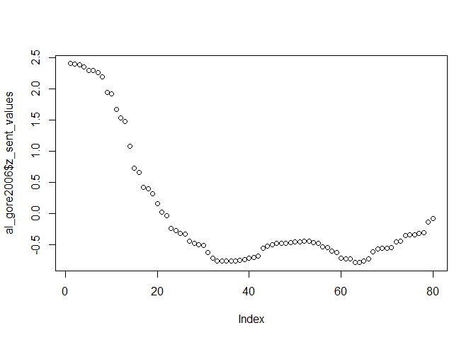
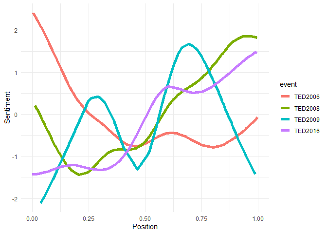
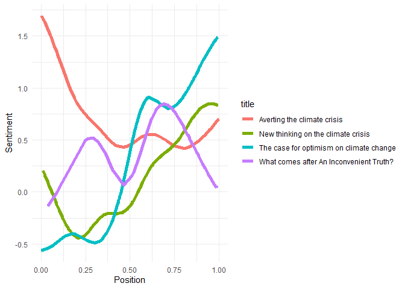
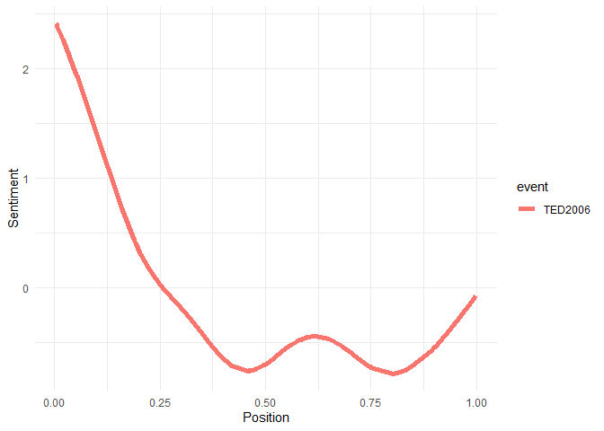
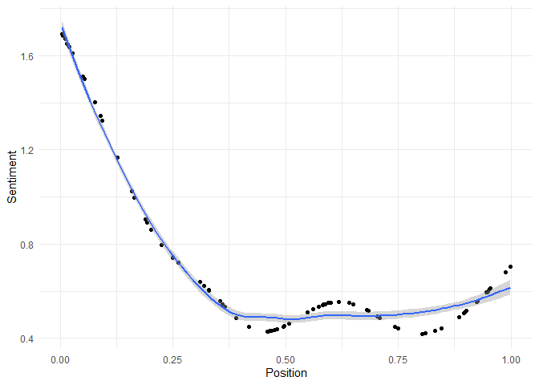
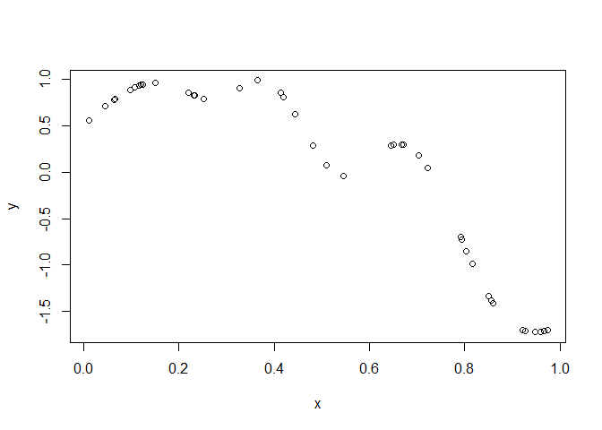

TED talks sentiment analysis
================
Loris, Nieves, Olivia
06/11/2020

Data taken from
[data.world](https://data.world/owentemple/ted-talks-complete-list).

# Load texts and inner join them

``` r
#load text
main = read.csv(file="data/ted_main.csv")
talks= read.csv(file="data/transcripts.csv")

#join 
data <- inner_join(y = main,x = talks)
```

    ## Joining, by = "url"

``` r
data = tibble(data)
```

# Tokenize and add sentiment

``` r
#tokenize
token_tbl = unnest_tokens(data, input = "transcript", token = "words", to_lower = FALSE, output = "word")


#relative position of the word

token_tbl = token_tbl %>% group_by(url) %>% mutate(
  pos = 1:n(),
  rel_pos = (pos-1)/max(pos-1)
)

library(textdata)
```

    ## Warning: package 'textdata' was built under R version 4.0.3

``` r
afinn = get_sentiments("afinn")
# colnames(afinn) = c("token", "sentiment")

token_tbl <- inner_join(y = afinn,x = token_tbl)
```

    ## Joining, by = "word"

``` r
# smoothing function
smooth = function(pos, value){ 
  sm = sapply(pos, function(x) {
    weights = dnorm(pos, x, max(pos) / 10)
    sum(value * (weights / sum(weights)))
    })
  }


token_tbl = token_tbl %>% group_by(url) %>% mutate(
  sent_values = smooth(pos, value)

)

token_tbl = token_tbl %>% group_by(url) %>% mutate(
  z_sent_values = scale(sent_values)
)


token_tbl = token_tbl %>% group_by(url) %>% mutate(
  cent_pos = scale(match(rel_pos, unique(rel_pos)), scale = FALSE)
)


token_tbl = token_tbl %>% group_by(url) %>% mutate(
  z_cent_pos = scale(cent_pos)
)

token_tbl=token_tbl %>% filter(!url=="https://www.ted.com/talks/bruno_bowden_folds_while_rufus_cappadocia_plays\n")
token_tbl=token_tbl %>% filter(!url=="https://www.ted.com/talks/james_burchfield_plays_invisible_turntables\n")


# token_tbl = token_tbl %>% group_by(url) %>% mutate(
# 
# )

# coef(quadratic)
al_gore2006 = token_tbl %>% filter(main_speaker=="Al Gore" & event=="TED2006")

max(al_gore2006$z_sent_values)
```

    ## [1] 2.406319

``` r
plot(al_gore2006$z_sent_values)
```

<!-- -->

``` r
# plot sentiment arcs z transformed
token_tbl %>% filter(main_speaker=="Al Gore"  ) %>% ggplot(aes(rel_pos, z_sent_values,color=event)) +
  geom_line(lwd=2) + 
  labs(x = "Position", y = 'Sentiment') + 
  theme_minimal()
```

<!-- -->

``` r
# plot sentiment arcs
token_tbl %>% filter(main_speaker=="Al Gore"  ) %>% ggplot(aes(rel_pos, sent_values,color=title)) +
  geom_line(lwd=2) + 
  labs(x = "Position", y = 'Sentiment') + 
  theme_minimal()
```

<!-- -->

``` r
# plot sentiment arcs
token_tbl %>% filter(main_speaker=="Al Gore"& event=="TED2006"  ) %>% ggplot(aes(rel_pos, z_sent_values,color=event)) +
  geom_line(lwd=2) +
  labs(x = "Position", y = 'Sentiment') + 
  theme_minimal()
```

<!-- -->

``` r
# # plot sentiment arcs
# token_tbl %>% filter(main_speaker=="Al Gore"& event=="TED2006"  ) %>% ggplot(aes(rel_pos,z_sent_values ,color=event)) +
#   geom_line(lwd=2) + geom_line(aes(rel_pos, SV1))+geom_line(aes(rel_pos, SV2))+
#   labs(x = "Position", y = 'Sentiment') + 
#   theme_minimal()


# plot


# lm(al_gore2006, formula = "rel_pos  ~  sent_values")

# plot sentiment arcs
token_tbl %>% filter(main_speaker=="Al Gore" & event=="TED2006" ) %>% ggplot(aes(rel_pos, sent_values)) +
  geom_point() + geom_smooth()+
  labs(x = "Position", y = 'Sentiment') + 
  theme_minimal()
```

    ## `geom_smooth()` using method = 'loess' and formula 'y ~ x'

<!-- --> \#
Calculate models for arcs

The idea here is, that all 6 arcs can be illustrated as models. The
first two arcs are linear models (positive/negative). The third and
forth are quadratic (positive/negative), and the last two are cubic
(positive/negative).

We just have to calculate all the models for each sentiment sequence to
see, which model fits best. Then we have the best model for each TED
talk.

``` r
# unique URLs in vector for loop through talks
talks = unique(token_tbl$url)
model_matrix = as.data.frame(matrix(data=NA, nrow= length(talks), ncol = 1))
rownames(model_matrix)=talks


# i = talks[1]
# token_tbl[token_tbl$url==i,"rel_pos"]
# lm(token_tbl[token_tbl$url==i,"rel_pos"],token_tbl[token_tbl$url==i,"z_sent_values"])


#loop through talks an calculate linear models
for(i in talks){
  #linear pos
  x=token_tbl[token_tbl$url==i,"rel_pos"][[1]]
  y=token_tbl[token_tbl$url==i,"z_sent_values"][[1]]
  model = lm(formula="y ~ x")
  model_matrix[i,1]= summary(model)[["r.squared"]][1]
  
  #quadratisch
  model2 = lm(y ~ x + I(x^2))
  model_matrix[i,2]= summary(model2)[["r.squared"]][1]
  
  #kubisch
  # x3 = poly(x,degree=3))
  model3 = lm(y ~ x + I(x^2) + I(x^3))
  model_matrix[i,3]= summary(model3)[["r.squared"]][1]
}

# round r squared
model_matrix = round(model_matrix, 5)

# compare models
anova(model, model2)
```

    ## Analysis of Variance Table
    ## 
    ## Model 1: y ~ x
    ## Model 2: y ~ x + I(x^2)
    ##   Res.Df    RSS Df Sum of Sq      F            Pr(>F)    
    ## 1     39 7.9922                                          
    ## 2     38 1.7706  1    6.2216 133.52 0.000000000000053 ***
    ## ---
    ## Signif. codes:  0 '***' 0.001 '**' 0.01 '*' 0.05 '.' 0.1 ' ' 1

``` r
anova(model2, model3)
```

    ## Analysis of Variance Table
    ## 
    ## Model 1: y ~ x + I(x^2)
    ## Model 2: y ~ x + I(x^2) + I(x^3)
    ##   Res.Df    RSS Df Sum of Sq      F Pr(>F)
    ## 1     38 1.7706                           
    ## 2     37 1.7585  1  0.012094 0.2545 0.6169

``` r
anova(model, model3)
```

    ## Analysis of Variance Table
    ## 
    ## Model 1: y ~ x
    ## Model 2: y ~ x + I(x^2) + I(x^3)
    ##   Res.Df    RSS Df Sum of Sq      F             Pr(>F)    
    ## 1     39 7.9922                                           
    ## 2     37 1.7585  2    6.2337 65.579 0.0000000000006853 ***
    ## ---
    ## Signif. codes:  0 '***' 0.001 '**' 0.01 '*' 0.05 '.' 0.1 ' ' 1

``` r
#plot 
plot(x,y)
```

<!-- -->
